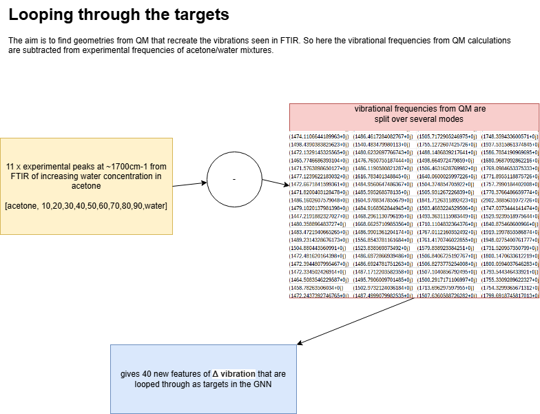

# Understanding the Geometry and Nature of Specific Interactions in Mixtures 

# Introduction

Chemical bonds in molecules vibrate at different frequencies depending upon their chemical environment. With increasing concentrations of substances in a mixture the non covalent interactions of a molecule change as the molecule interacts with other species, altering the geometry and the vibrations of the molecule. The most simple example of this can be in a mixture of water, where adding acetone disrupts the hydrogen bonding of water and causes the carbonyl of acetone to vibrate at slightly different frequencies than it would on its own.

The aim of this project is to use FTIR spectroscopy, Quantum Mechanical (QM) calculations and Machine Learning (ML) methods to understand the changing geometry of molecules in mixtures due to changes in non covalent interactions. A simple starting system of water and acetone causes a shift of the carbonyl peak at around 1700cm-1 with increasing water content and hydrogen bond strength. 

In the case of the water acetone system, QM methods are used to sample different geometries of water at distances of between 2-4 angstroms from acetone. This provides features including frequency data, dipole moment, reduced mass, intensity, energy, geometry, coulomb matrices to be used with ML models.  With the inclusion of experimental FTIR data of the acetone mixtures as the target, the geometry of the acetone water complex can be reverse engineered using Grap Neural Networks.

# Method
The FTIR has been collected on a Nicolet iD7 with a resolution of 4cm-1. acetone = 10.csv with increasing water -> 0.csv = water.

1. Optimise the xyz complexes of acetone and water

2. Center the oxygen on the acetone carbonyl to 0,0,0

3. Create ~1000 geometries of water around the acetone.
create_initial_geometries(G).ipynb

4. Run QM using Psi4, calculating vibrational frequencies and other features.
run_QM.py

5. Create a .sdf file made up of the ~500 geometries.
create_sdf(G).ipynb

6. Subtract the QM frequencies from the experimental values, giving "delta frequencies" and add these to the features.
add_delta_experiment_values(G).py

7. Combine the QM features with the .sdf geometries into a graph to use in a GNN.

8. Run the GNN model, looping through the "delta frequencies" where geometries that give a value close to 0 are similar to the experimental data.
run_GNN.ipynb

# Background
FTIR blue and red shifts, 

Dilution of acetone with either water or carbon tetrachloride shifts the carbonyl band red or blue, respectively

https://assets.thermofisher.com/TFS-Assets/CAD/Application-Notes/AN50733_E.pdf

"The strong bathochromic shifts observed on methanol OH and acetone CO stretch IR bands are related to hydrogen bonds between these groups. Factor analysis separates the spectra into four acetone and four methanol principal factors." 
https://doi.org/10.1063/1.1790431

"Analysis  of  IR  spectra  of  ethylene  glycol  shows  that  thereare only a few contributing bands with solidly fixed vibrationalfrequencies,  which  only  change  in  relative  intensity  whentemperature is changed. It did not show any clear evidence ofan intrinsic frequency shift indicating the gradual weakening ofhydrogen bonding interaction. Only the relative population ofspecies,  e.g.,  strongly  bonded  and  dissociated  or  much  moreweakly  bonded  groups,  seems  to  be  changing.  IR  spectra  ofacetone   in   a   mixed   solvent   of   CHCl3/CCl4with   varyingcomposition  also  show  that  intrinsic  IR  frequency  does  notshift  appreciably.  Instead,  only  the  relative  contributions  ofhighly overlapped adjacent bands are changing."
https://doi.org/10.1366/000370210792434396

# Results

# References

https://cs229.stanford.edu/proj2017/final-reports/5244394.pdf

https://www.spectroscopyonline.com/view/five-reasons-why-not-every-peak-shift-in-infrared-ir-spectra-indicates-a-chemical-structure-change

