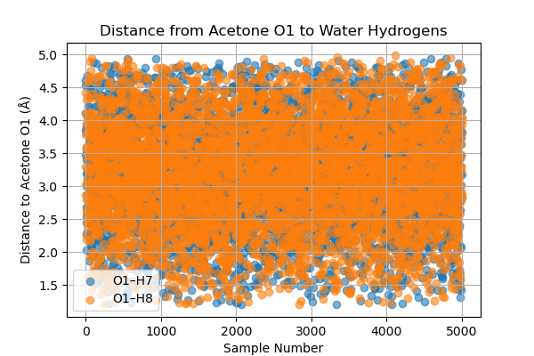
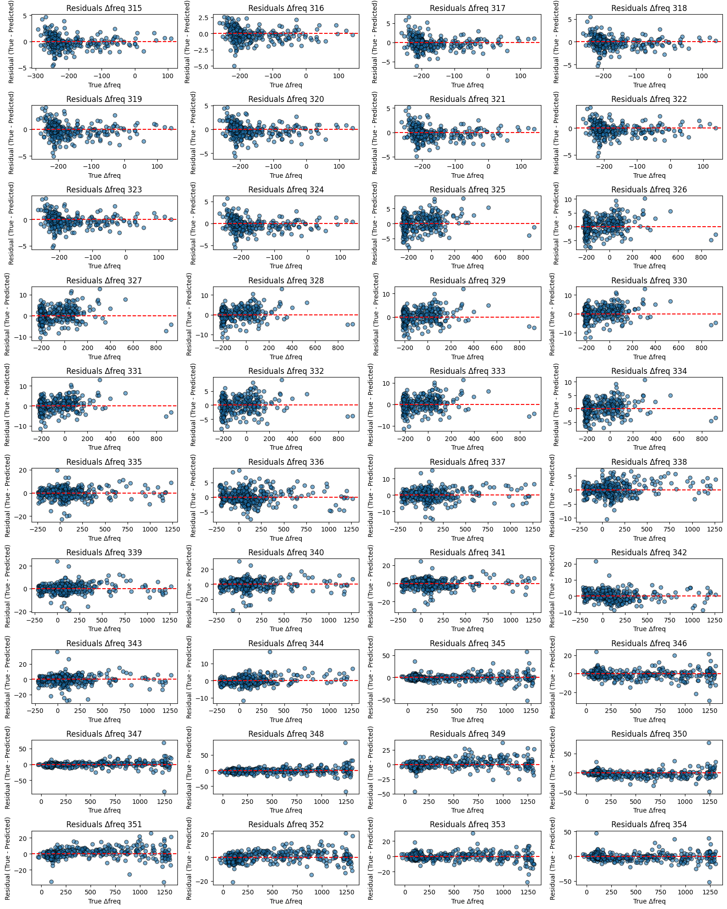
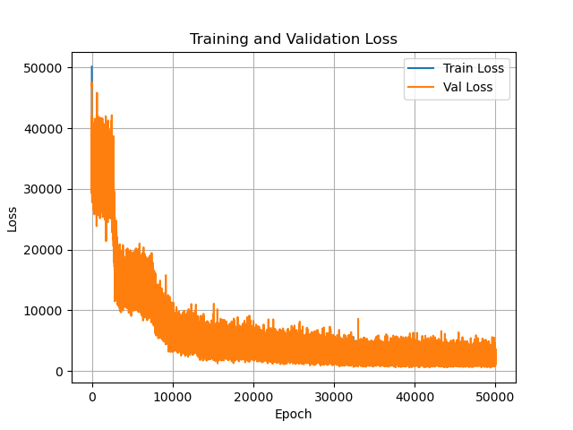
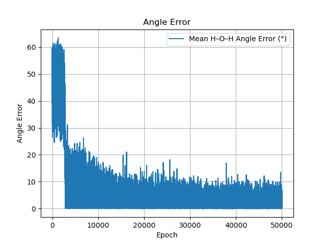
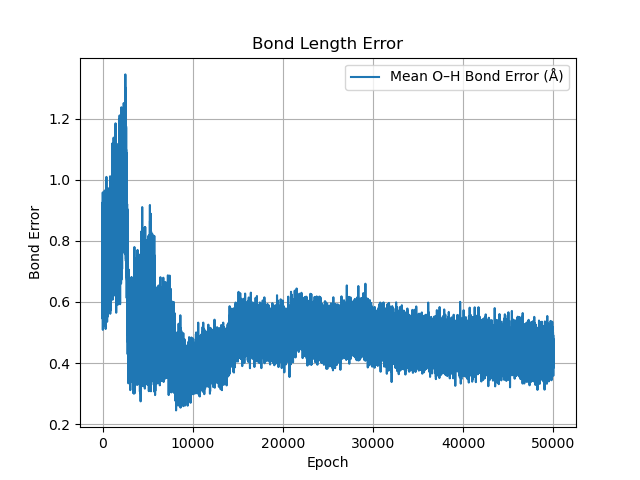
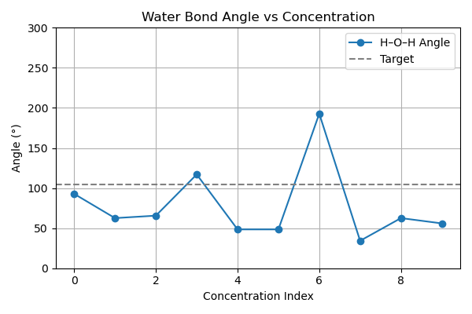
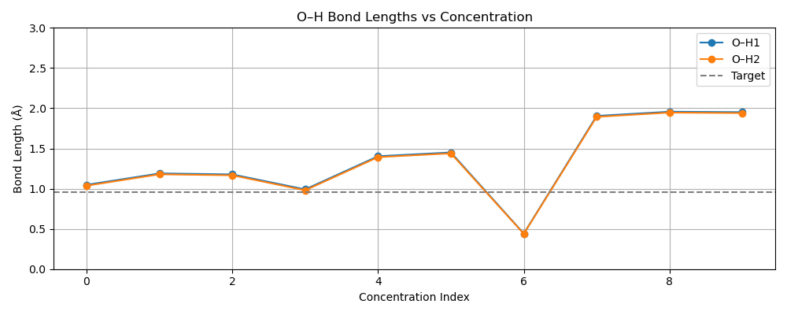

# Understanding the Geometry and Nature of Specific Interactions in Mixtures 

# Abstract 

Non covalent interactions in mixtures vary with concentration and cause shifts in the vibrational modes of molecular functional groups, seen by IR spectroscopy. It can be suggested that with changing concentration and non covalent interactions, the geometry of a molecule complex changes in a similar way to well known reaction mechanisms such as nucleophilic and electrophilic substitution. The frequency shifts for simple acetone water mixtures vary up to 5cm-1 requiring high predictive accuracy and supporting the idea that the geometries follow a small change in trajectory. Variational auto encoder models can be used with Graph Neural networks to represent the molecular structure of complexes and can make predictions using QM features with the target being experimental IR peaks. Initial results show that the GNN model can predict within this range (residuals predictions). Further work is required to include variations in the training data, varying covalent bond lengths and angles to provide more valid vibrational frequencies.

# Introduction

Chemical bonds in molecules vibrate at different frequencies depending upon their chemical environment. With increasing concentrations of substances in a mixture the non covalent interactions of a molecule change as the molecule interacts with other species, altering the geometry and the vibrations of the molecule. The most simple example of this can be in a mixture of water, where adding acetone disrupts the hydrogen bonding of water and causes the carbonyl of acetone to vibrate at slightly different frequencies than it would on its own.

The aim of this project is to use FTIR spectroscopy, Quantum Mechanical (QM) calculations and Machine Learning (ML) methods to understand the changing geometry of molecules in mixtures due to changes in non covalent interactions. A simple starting system of water and acetone is used that causes a shift of the carbonyl peak at around 1700cm-1 with increasing water content and hydrogen bond strength. 

In the case of the water acetone system, QM methods are used to sample different geometries of water at distances of between 2-4 angstroms from acetone. This provides features including frequency data, dipole moment, reduced mass, intensity, energy, geometry, coulomb matrices to be used with ML models.  With the inclusion of experimental FTIR data of the acetone mixtures as the target, the geometry of the acetone water complex can be reverse engineered using Graph Neural Networks.

# Method

The FTIR has been collected on a Nicolet iD7 with a resolution of 4cm-1. 
acetone = 10.csv with increasing water -> 0.csv = water. 

The carbonyl (~1700cm-1) peak of each concentration is determined using Voigt peak fitting. 
(voigt_peak_centre.py) 

The QM data has been created as below, 

1. Optimise the xyz complexes of acetone and water

2. Center the oxygen on the acetone carbonyl to 0,0,0

3. Create ~5000 geometries of water around the acetone.
(create_initial_geometries(G).ipynb)

4. Run QM using Psi4, calculating vibrational frequencies and other features.
(run_QM.py)

5. Filter the geometries that produce useful carbonyl related vibrations and create a graph for use in ML.
(create_graph.py)

6. A conditional Graph VAE was trained to generate new water geometries around the fixed acetone molecule.  Penalties where applied to the O-H bond length and H-O-H angles and Kullback-Leibler divergence was used with warm up scheduling.
(VAE.py)

7. Geometries are predicted using the VAE for each of the experimental FTIR concentration ranges.
(create_geometries.py)

# Background
FTIR blue and red shifts, 

Dilution of acetone with either water or carbon tetrachloride shifts the carbonyl band red or blue, respectively

https://assets.thermofisher.com/TFS-Assets/CAD/Application-Notes/AN50733_E.pdf

"The strong bathochromic shifts observed on methanol OH and acetone CO stretch IR bands are related to hydrogen bonds between these groups. Factor analysis separates the spectra into four acetone and four methanol principal factors." 
https://doi.org/10.1063/1.1790431

"Analysis  of  IR  spectra  of  ethylene  glycol  shows  that  there are only a few contributing bands with solidly fixed vibrational frequencies,  which  only  change  in  relative  intensity  when temperature is changed. It did not show any clear evidence of an intrinsic frequency shift indicating the gradual weakening of hydrogen bonding interaction. Only the relative population of species,  e.g.,  strongly  bonded  and  dissociated  or  much  more weakly  bonded  groups,  seems  to  be  changing.  IR  spectra  of acetone   in   a   mixed   solvent   of   CHCl3/CCl4with   varying composition  also  show  that  intrinsic  IR  frequency  does  notshift  appreciably.  Instead,  only  the  relative  contributions  of highly overlapped adjacent bands are changing."
https://doi.org/10.1366/000370210792434396

# Results
Psi4 was used to compute the vibrational frequencies of acetone, with the carbonyl peak distributed across four distinct modes. For each of these modes, the calculated values were compared to experimental FTIR data collected at ten different water–acetone concentrations. This yielded 40 frequency shift values (4 modes × 10 concentrations), which served as target outputs for a Graph Neural Network (GNN). The GNN predictions showed a deviation of no more than ±5 cm⁻¹ from the calculated frequency differences.

Using the GNN with a variational auto encoder to predict new geometries. The bond length error (O–H) stabilized around 0.4 Å, with early fluctuation likely due to KL warm-up. Angle error (H–O–H) dropped from over 60° to under 10°, showing the model learning the getting close to the correct water angle. Training and validation losses both decreased steeply and then plateaued, indicating learning without overfitting.

The trained Conditional GraphVAE model was evaluated for its ability to reconstruct geometries. The focus was on maintaining realistic O–H bond lengths (~0.96 Å) and the H–O–H bond angle (~104.5°) across different concentration conditions.

O–H Bond Lengths
The predicted bond lengths for O–H₁ and O–H₂ remain close to the target value in most concentration settings, but certain indices show elevated bond lengths (~2.0 Å), indicating occasional model instability. A dashed line at 0.96 Å provides a reference for the ideal value. These deviations suggest a need to strengthen the bond loss term or explore outlier geometries in training.

H–O–H Bond Angle 
The model is less accurate with angle prediction. While the target angle is ~104.5°, fluctuations are seen across concentration indices, with angles as low as ~35° and as high as ~195°. 

# Further work 

The bond angle loss weighting should be increased to improve the accuracy of this property. 

Look at using alternative constraints in the decoder. 

Remove poor geometries 

Include water acetone complexes with varied covalent bond lengths.

Run QM on predicted geometries and loop this back into the model. 

Compare other graph neural network architectures 

# References

https://cs229.stanford.edu/proj2017/final-reports/5244394.pdf

https://www.spectroscopyonline.com/view/five-reasons-why-not-every-peak-shift-in-infrared-ir-spectra-indicates-a-chemical-structure-change

Graph neural networks for materials science and
chemistry
https://www.nature.com/articles/s43246-022-00315-6.pdf

Infrared Spectra Prediction Using Attention-Based Graph Neural Networks. Digital Discovery, Royal Society of Chemistry.
https://doi.org/10.1039/D3DD00254C

Excess Gibbs Free Energy Graph Neural Networks for Predicting Composition-Dependent Activity Coefficients of Binary Mixtures. arXiv preprint.
https://arxiv.org/abs/2407.18372

Representation Learning with a β-Variational Autoencoder for Infrared Spectroscopy. 
https://www.researchgate.net/publication/361453151

Anomaly Detection in Fourier Transform Infrared Spectroscopy of Pharmaceutical Tablets Using Variational Autoencoders. Chemometrics and Intelligent Laboratory Systems, 
https://doi.org/10.1016/j.chemolab.2023.104781

Infrared Spectroscopy of Acetone–Water Liquid Mixtures: Molecular Organization and Hydrogen Bonding. 
https://pubmed.ncbi.nlm.nih.gov/15267555

Spectroscopy from Machine Learning by Accurately Representing Molecular Structures. Nature Communications
https://www.nature.com/articles/s41467-023-36957-4

Learning Molecular Mixture Properties Using Chemistry-Aware Graph Neural Networks.
https://doi.org/10.1103/PRXEnergy.3.023006

Auto-Encoding Variational Bayes.
https://arxiv.org/abs/1312.6114

Automatic Chemical Design Using a Data-Driven Continuous Representation of Molecules.
https://doi.org/10.1021/acscentsci.7b00572

A Generative Model for Molecular Distance Geometry.
https://proceedings.neurips.cc/paper/2020/hash/fb60d411a5c5c4c7bd16c6d0bd1780b9-Abstract.html

GemNet: Universal Directional Graph Neural Networks for Molecules.
https://arxiv.org/abs/2106.08903

