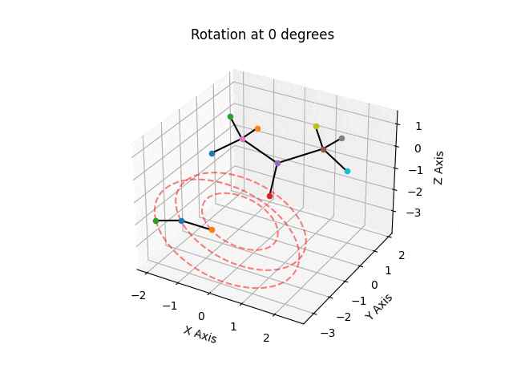
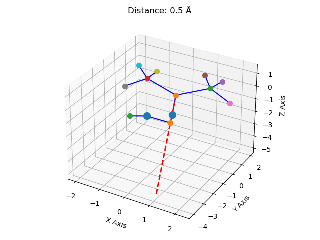
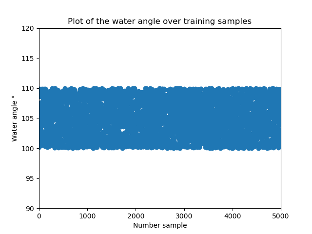
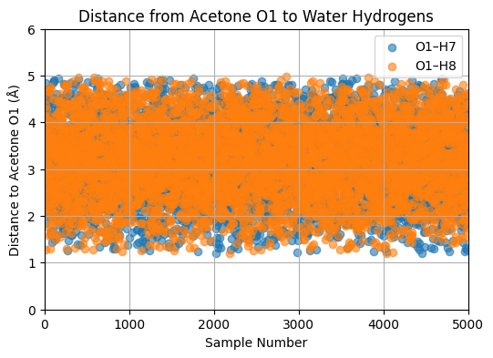
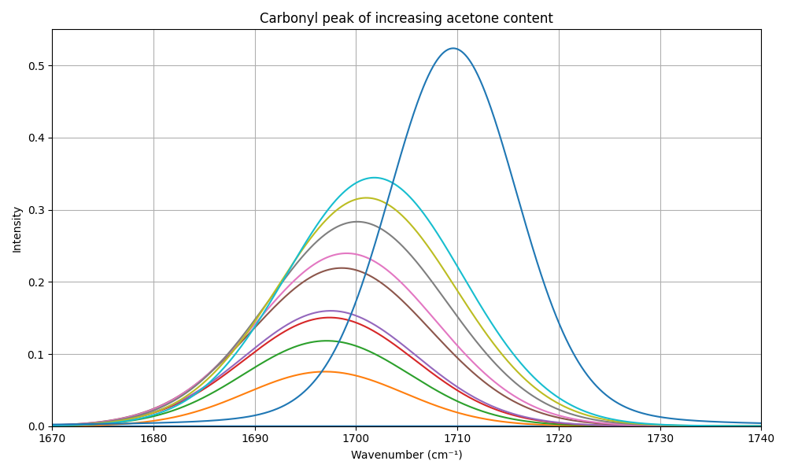
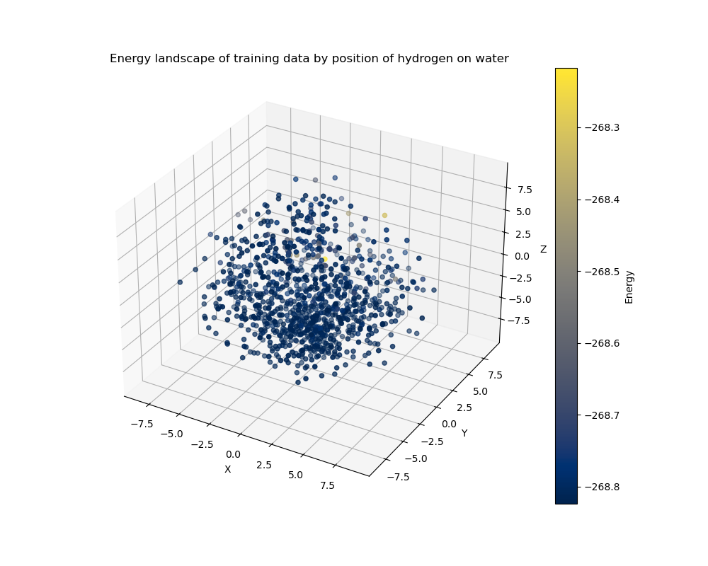
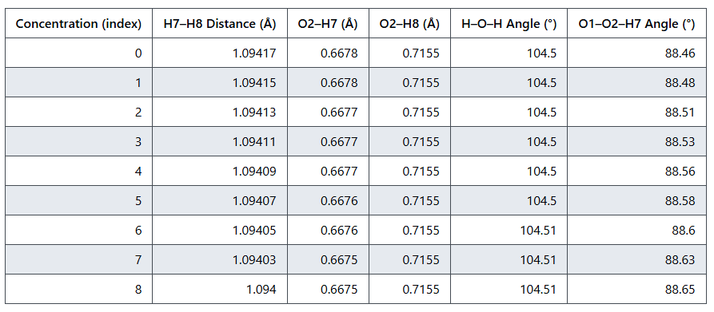

# Understanding the Geometry and Nature of Specific Interactions in Mixtures 

# Abstract 

The energy of a molecule’s vibrational modes changes with its chemical environment, causing shifts in characteristic bands observed by FTIR spectroscopy. For mixtures, changes in concentration can strengthen or weaken non-covalent interactions, altering the geometry of molecular complexes and shifting absorption frequencies. These subtle structural variations can influence important properties such as solubility, reactivity, and binding affinity.

This work aims to understand how the geometry of small-molecule complexes, particulalry acetone and water respond to concentration-dependent interactions. It combines quantum mechanical calculations with machine learning models—specifically Graph Neural Networks and Variational Autoencoders—to predict IR frequency shifts based on molecular geometry. Understanding changes in geometries is useful for applications in biological systems, catalysis, and formulation science.

 

# Introduction

Chemical bonds in molecules vibrate at different frequencies depending upon their chemical environment. With increasing concentrations of substances in a mixture the non covalent interactions of a molecule change as the molecule interacts with other species, altering the geometry and the vibrations of the molecule. The most simple example of this can be in a mixture of water, where adding acetone disrupts the hydrogen bonding of water and causes the carbonyl of acetone to vibrate at slightly different frequencies than it would on its own.

The aim of this project is to use FTIR spectroscopy, Quantum Mechanical (QM) calculations and Machine Learning (ML) methods to understand the changing geometry of molecules in mixtures due to changes in non covalent interactions. A simple starting system of water and acetone is used that causes a shift of the carbonyl peak at around 1700cm-1 with increasing water content and hydrogen bond strength. 

In the case of the water acetone system, QM methods are used to sample different geometries of water at distances of between 2-4 angstroms from acetone. This provides features including frequency data, dipole moment, reduced mass, intensity, energy, geometry, coulomb matrices to be used with ML models.  With the inclusion of experimental FTIR data of the acetone mixtures as the target, the geometry of the acetone water complex can be reverse engineered using Graph Neural Networks.

# Method

Mixtures of acetone and water were prepared across a range of volume ratios from 10:90 to 90:10 (acetone:water) and the FTIR spectrum was taken for each. The FTIR has been collected on a Nicolet iD7 with a resolution of 2cm-1. 

The carbonyl peak of each concentration is determined using Voigt peak fitting and the difference between the experimental peak and the QM calculated vibrations are used as the target for Machine Learning. (voigt_peak_centre.py) 

The QM training data has been created as below, 

1. Optimise the xyz complexe of acetone and water

2. Center the oxygen on the acetone carbonyl to 0,0,0

3. Create geometries of water around the acetone. Setting parameters for the hydrogen bond lengths and water angles.
(create_initial_geometries(G).ipynb)

4. Run QM using Psi4, calculating vibrational frequencies and other features. For the QM training data 1000 geometries have been used.
(run_QM.py)

5. Filter the geometries that produce useful carbonyl related vibrations and create a graph for use in ML.
(create_graph.py)

6. A conditional Graph VAE was trained to generate new water geometries around the fixed acetone molecule. The model incorporated both Graph Convolutional Networks (GCNs) and Graph Attention Networks (GATs) in the encoder and decoder. Penalties were applied to the O–H bond lengths and H–O–H angles, and Kullback–Leibler divergence was used with warm-up scheduling.(VAE.py)

7. Optuna was used Optuna with Bayesian optimisation to tune loss weights and training epochs, minimising the validation loss.

8. Geometries are predicted using the VAE for each of the concentration ranges.
(create_geometries.py)

# Background
FTIR blue and red shifts, 

Dilution of acetone with either water or carbon tetrachloride shifts the carbonyl band red or blue, respectively

https://assets.thermofisher.com/TFS-Assets/CAD/Application-Notes/AN50733_E.pdf

"The strong bathochromic shifts observed on methanol OH and acetone CO stretch IR bands are related to hydrogen bonds between these groups. Factor analysis separates the spectra into four acetone and four methanol principal factors." 
https://doi.org/10.1063/1.1790431

"Analysis  of  IR  spectra  of  ethylene  glycol  shows  that  there are only a few contributing bands with solidly fixed vibrational frequencies,  which  only  change  in  relative  intensity  when temperature is changed. It did not show any clear evidence of an intrinsic frequency shift indicating the gradual weakening of hydrogen bonding interaction. Only the relative population of species,  e.g.,  strongly  bonded  and  dissociated  or  much  more weakly  bonded  groups,  seems  to  be  changing.  IR  spectra  of acetone   in   a   mixed   solvent   of   CHCl3/CCl4with   varying composition  also  show  that  intrinsic  IR  frequency  does  notshift  appreciably.  Instead,  only  the  relative  contributions  of highly overlapped adjacent bands are changing."
https://doi.org/10.1366/000370210792434396

# Results
The FTIR plots of the carbonyl peak of the mixtures show a shift of ±5cm-1 with increasing acetone content in Results 1. 

Results 1. FTIR of carbonyl peak with increasing acetone, showing acetone carbonyl peak for reference

The training features were produced with QM using acetone and water at different geometries. Results 2 shows how the position of a hydrogen atom in the water molecule varies across the energy landscape of the training dataset.

Results 2. Training data shows the position of hydrogen on the energy landscape

Three different Graph Neural Network (GNN) architectures—GCN, GAT, and Transformer were compared based on their ability to predict bond lengths and bond angles in molecular structures. Model performance was optimised using Optuna with Bayesian search, tuning key hyperparameters including bond loss, angle loss, maximum kl divergence and number of training epochs.

Bond Error (Å):
Mean absolute bond length errors show that all models perform reasonably, but the GAT and Transformer models have fewer extreme outliers and lower median error than GCN.

Angle Error (°):
Angle predictions are notably more accurate with Transformer, which shows the lowest mean and variance. GCN, by contrast, exhibits high variability and larger errors.

These results suggest that attention-based models including GAT and Transformer offer improved geometric fidelity in molecular structure prediction tasks.

Results 3. Comparison of losses for different architectures 

Results 4. show the predicted internal angles of water with increasing concentration around the static acetone molecule. The distance between the oxygen on the acetone carbonyl and the hydrogens on the water give distances above the standard hydrogen bond distance.

Results 4. Predicted geometry properties from the transformer VAE 

Based upon the angle change and frequency shift a quadratic function is proposed.

Results 5. Quadratic fit of the frequency shift vs the angle between O1 on acetone and H7 on the water 

# Further work 

* The predicted geometries from the VAE put the hydrogens on the water at a distance of ~3.6Å, this means that running psi4 calculations on these molecules does not give peaks back at around 1700cm-1. is this due to the spread of the training data? Will reducing training geometries with hydrogen bond lengths over 3Å improve the prediction. The same can be said about the internal angles predicted for the water at ~105°.

A hydrogen bond loss of 2Å forced the predicted geometries to have a distance of ~1.9Å from carbonyl oxygen to the hydrogen on water but this seems to constrain the system too much so the distance must be learnt in a better way. 

Either a potential energy function is fitted to one geometry and used as a loss function in the learning. Or another neural network is built to learn the energy term and use this as a loss function in the original VAE.

* The length of the carbonyl bond needs to be varied in the training data to provide better understanding.

# References

https://cs229.stanford.edu/proj2017/final-reports/5244394.pdf

https://www.spectroscopyonline.com/view/five-reasons-why-not-every-peak-shift-in-infrared-ir-spectra-indicates-a-chemical-structure-change

Graph neural networks for materials science and
chemistry
https://www.nature.com/articles/s43246-022-00315-6.pdf

Infrared Spectra Prediction Using Attention-Based Graph Neural Networks. Digital Discovery, Royal Society of Chemistry.
https://doi.org/10.1039/D3DD00254C

Excess Gibbs Free Energy Graph Neural Networks for Predicting Composition-Dependent Activity Coefficients of Binary Mixtures. arXiv preprint.
https://arxiv.org/abs/2407.18372

Representation Learning with a β-Variational Autoencoder for Infrared Spectroscopy. 
https://www.researchgate.net/publication/361453151

Anomaly Detection in Fourier Transform Infrared Spectroscopy of Pharmaceutical Tablets Using Variational Autoencoders. Chemometrics and Intelligent Laboratory Systems, 
https://doi.org/10.1016/j.chemolab.2023.104781

Infrared Spectroscopy of Acetone–Water Liquid Mixtures: Molecular Organization and Hydrogen Bonding. 
https://pubmed.ncbi.nlm.nih.gov/15267555

Spectroscopy from Machine Learning by Accurately Representing Molecular Structures. Nature Communications
https://www.nature.com/articles/s41467-023-36957-4

Learning Molecular Mixture Properties Using Chemistry-Aware Graph Neural Networks.
https://doi.org/10.1103/PRXEnergy.3.023006

Auto-Encoding Variational Bayes.
https://arxiv.org/abs/1312.6114

Automatic Chemical Design Using a Data-Driven Continuous Representation of Molecules.
https://doi.org/10.1021/acscentsci.7b00572

A Generative Model for Molecular Distance Geometry.
https://proceedings.neurips.cc/paper/2020/hash/fb60d411a5c5c4c7bd16c6d0bd1780b9-Abstract.html

GemNet: Universal Directional Graph Neural Networks for Molecules.
https://arxiv.org/abs/2106.08903
 

