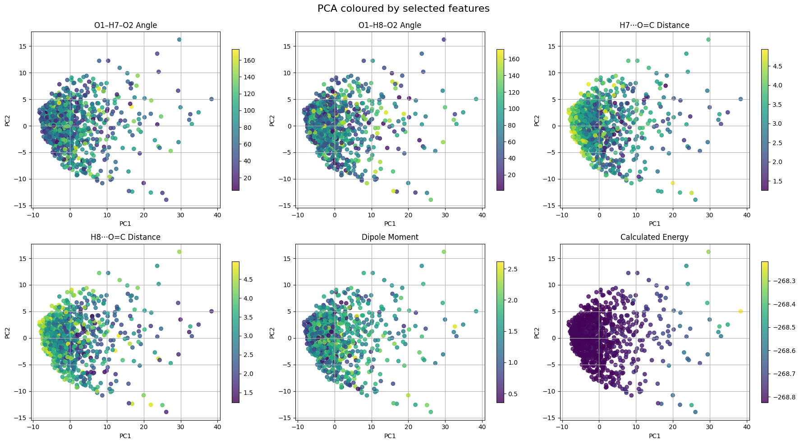

# Understanding the Geometry and Nature of Specific Interactions in Mixtures 

# Project Overview
This project uses Quantum Chemistry, FTIR Spectroscopy, and Machine Learning to uncover how the geometry of acetone water complexes shifts with changing concentration.

- *Goal* Understand and predict how water geometries around acetone change with concentration by modelling IR shifts.
- *Approach* Generate QM optimised conformations and extract physical and spectral descriptors. Use a Conditional Graph Variational Autoencoder (VAE) to predict water geometries based on IR/QM features. Evaluate how frequently these generated geometries appear in molecular dynamics simulations.
- *Analogy to Drug Discovery* This workflow mirrors virtual screening pipelines, generating conformers, scoring based on IR/QM criteria, and filtering based on H-bond geometry. In place of binding affinity scores, the VAE is trained with loss functions that penalise deviations from experimentally derived IR frequency shifts, bond lengths and angles, analogous to optimising ligand poses against binding or activity targets.

  
  

# Tools and Frameworks 

PyTorch, PyTorch Geometric, Scikit-learn, Psi4, PySCF, GROMACS, NumPy, Pandas, Matplotlib, Git, Linux shell scripting, Google Colab

# Introduction

The vibrational frequencies of molecules vary due to their chemical environment, such as changing concentration. This is identified by the broadening and shifting of FTIR peaks. The broadening of the carbonyl peak in FTIR spectra with increasing water content suggests a distribution of possible acetone–water geometries, including both bent and colinear hydrogen-bonded structures as reported in the literature. These shifts arise from a thermal ensemble of structures where hydrogen bonding strength, methyl group orientation, and water position fluctuate. 

The aim of this project is to combine FTIR Spectroscopy, Quantum Mechanical (QM) calculations and Machine Learning (ML) methods to understand the changing and plausible geometries of water acetone complexes due to changes in non covalent interactions.

In the case of the water acetone system, QM methods are used to sample geometries of water at distances of between 2-4 angstroms from acetone. This provides features including frequency data, dipole moment, reduced mass, intensity, energy, geometry, coulomb matrices that form the condition vector of the VAE.  

# Method

Mixtures of acetone and water were prepared across a range of volume ratios from 10:90 to 90:10 (acetone:water) and the FTIR spectrum was taken for each. The FTIR has been collected on a Nicolet iD7 with a resolution of 2cm-1. 

The carbonyl peak of each concentration is determined using Voigt peak fitting and the difference between the experimental peak and the QM calculated vibrations are used as the target for Machine Learning. (voigt_peak_centre.py) 

The QM training set is made up of 1000 conformations of water surrounding a static acetone molecule (create_initial_geometries(G).ipynb)

  
  

  Comparison of angle and distance dimensions created in the training data.

Quantum mechanical calculations were performed using Psi4 at the MP2 level of theory with the cc-pVDZ basis set. Each geometry underwent vibrational frequency analysis (without reoptimization), and the resulting dipole moments, total energies, IR intensities, frequencies, and reduced masses were extracted as features for training (see run_QM.py).

The features extracted included 
* dipole
* energy
* coulomb matrix (coulomb_matrix_function.py)

correlated features
* reduced mass
* ir intensity
* frequencies

included in graph edge features
* hydrogen-carbonyl distances and angles

Both supervised and unsupervised analysis methods where used to understand the structure and importance of the feature dataset using Principal Component Analysis (PCA) and XGBoost (feature_analysis.py)

The geometries that produce useful carbonyl related vibrations where then filtered and graphs where created using PyTorch Geometric.
(create_graph.py)

Optuna with Bayesian optimisation identified that a Transformer-based graph architecture (TransformerConv) was best suited to the dataset. This architecture was then used in both the encoder and decoder of a conditional Graph Variational Autoencoder (VAE) to generate new water geometries around a fixed acetone molecule. Penalty terms were applied to constrain O–H bond lengths and H–O–H angles, while a warm-up schedule was used for the Kullback–Leibler (KL) divergence. The optimisation process also tuned loss weights and training epochs to minimize the validation loss. Both deterministic and stochastic sampling approaches were used to produce geometries from the latent space (tramsformer_VAE.py)

# Background
FTIR blue and red shifts, 

Dilution of acetone with either water or carbon tetrachloride shifts the carbonyl band red or blue, respectively

https://assets.thermofisher.com/TFS-Assets/CAD/Application-Notes/AN50733_E.pdf

"The strong bathochromic shifts observed on methanol OH and acetone CO stretch IR bands are related to hydrogen bonds between these groups. Factor analysis separates the spectra into four acetone and four methanol principal factors." 
https://doi.org/10.1063/1.1790431

"Analysis  of  IR  spectra  of  ethylene  glycol  shows  that  there are only a few contributing bands with solidly fixed vibrational frequencies,  which  only  change  in  relative  intensity  when temperature is changed. It did not show any clear evidence of an intrinsic frequency shift indicating the gradual weakening of hydrogen bonding interaction. Only the relative population of species,  e.g.,  strongly  bonded  and  dissociated  or  much  more weakly  bonded  groups,  seems  to  be  changing.  IR  spectra  of acetone   in   a   mixed   solvent   of   CHCl3/CCl4with   varying composition  also  show  that  intrinsic  IR  frequency  does  notshift  appreciably.  Instead,  only  the  relative  contributions  of highly overlapped adjacent bands are changing."
https://doi.org/10.1366/000370210792434396

# Results
The FTIR plots of the carbonyl peak of the mixtures show a shift of ±5cm-1 with increasing acetone content in Results 1. From right to left with increasing water concentration there are more possible water acetone conformations possible leading to broadening of the peaks.

Results 1. FTIR of carbonyl peak with increasing acetone, showing acetone carbonyl peak for reference

The training features were produced with QM using acetone and water at different geometries. Results 2 shows how the position of a hydrogen atom in the water molecule varies across the energy landscape of the training dataset.

Results 2. Training data shows the position of hydrogen on the energy landscape

The PCA plots reveal clear structure–property trends across the dataset. Distances from water hydrogens to the carbonyl oxygen (H7···O=C and H8···O=C) and dipole moments show smooth gradients across PC1, indicating they are key contributors to variance in the data. Angular features are more uniformly distributed, while calculated energy is tightly clustered with a few distinct low-energy outliers. These results suggest that geometric features, particularly distances and dipoles, are more strongly captured in the principal components.

Results 3. PCA coloured by feature

Three different Graph Neural Network (GNN) architectures—GCN, GAT, and Transformer were compared based on their ability to predict bond lengths and bond angles in molecular structures. Model performance was optimised using Optuna with Bayesian search, tuning key hyperparameters including bond loss, angle loss, maximum kl divergence and number of training epochs.

Bond Error (Å):
Mean absolute bond length errors show that all models perform reasonably, but the GAT and Transformer models have fewer extreme outliers and lower median error than GCN.

Angle Error (°):
Angle predictions are notably more accurate with Transformer, which shows the lowest mean and variance. GCN, by contrast, exhibits high variability and larger errors.

These results suggest that attention-based models including GAT and Transformer offer improved geometric fidelity in molecular structure prediction tasks.

  
  

Results 4. Comparison of losses for different architectures 

Results 5. Comparison of bond lengths and angles for the water acetone systems using the VAE

Results 6. Predicted geometries from both the deterministic and stochiastic sampling methods 

# Further work 

* The predicted geometries from the VAE put the hydrogens on the water at a distance of ~3.6Å, this means that running Psi4 calculations on these molecules does not give peaks back at around 1700cm-1. is this due to the spread of the training data? Will reducing training geometries with hydrogen bond lengths over 3Å improve the prediction. The same can be said about the internal angles predicted for the water at ~105°.

Either a potential energy function is fitted to one geometry and used as a loss function in the learning. Or another neural network is built to learn the energy term and use this as a loss function in the original VAE.

This was resolved by introducing a "hydrogen bond distance loss" 

* It is important to represent the broad peaks with a variety of geometries when the water concentration is high. A method to average the geometries at a concentration is needed or identify these angles and distances in molecular dynamics simulations to validate the results.

* The length of the carbonyl bond needs to be varied in the training data to provide better understanding.

* The broad nature of the carbonyl peak with additions of water show diversity in the geometries of the water acetone system. Other sharper peaks may provide better insight into geometry changes.

# References

https://cs229.stanford.edu/proj2017/final-reports/5244394.pdf

https://www.spectroscopyonline.com/view/five-reasons-why-not-every-peak-shift-in-infrared-ir-spectra-indicates-a-chemical-structure-change

Graph neural networks for materials science and
chemistry
https://www.nature.com/articles/s43246-022-00315-6.pdf

Infrared Spectra Prediction Using Attention-Based Graph Neural Networks. Digital Discovery, Royal Society of Chemistry.
https://doi.org/10.1039/D3DD00254C

Excess Gibbs Free Energy Graph Neural Networks for Predicting Composition-Dependent Activity Coefficients of Binary Mixtures. arXiv preprint.
https://arxiv.org/abs/2407.18372

Representation Learning with a β-Variational Autoencoder for Infrared Spectroscopy. 
https://www.researchgate.net/publication/361453151

Anomaly Detection in Fourier Transform Infrared Spectroscopy of Pharmaceutical Tablets Using Variational Autoencoders. Chemometrics and Intelligent Laboratory Systems, 
https://doi.org/10.1016/j.chemolab.2023.104781

Infrared Spectroscopy of Acetone–Water Liquid Mixtures: Molecular Organization and Hydrogen Bonding. 
https://pubmed.ncbi.nlm.nih.gov/15267555

Spectroscopy from Machine Learning by Accurately Representing Molecular Structures. Nature Communications
https://www.nature.com/articles/s41467-023-36957-4

Learning Molecular Mixture Properties Using Chemistry-Aware Graph Neural Networks.
https://doi.org/10.1103/PRXEnergy.3.023006

Auto-Encoding Variational Bayes.
https://arxiv.org/abs/1312.6114

Automatic Chemical Design Using a Data-Driven Continuous Representation of Molecules.
https://doi.org/10.1021/acscentsci.7b00572

A Generative Model for Molecular Distance Geometry.
https://proceedings.neurips.cc/paper/2020/hash/fb60d411a5c5c4c7bd16c6d0bd1780b9-Abstract.html

GemNet: Universal Directional Graph Neural Networks for Molecules.
https://arxiv.org/abs/2106.08903
 

